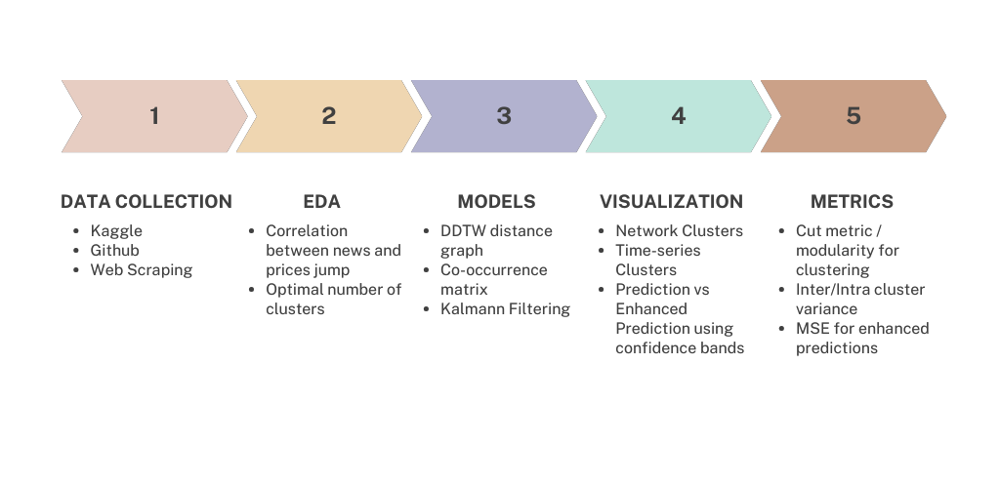
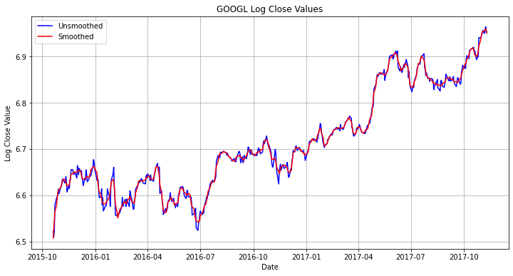
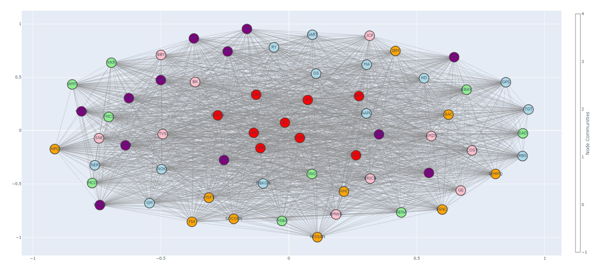
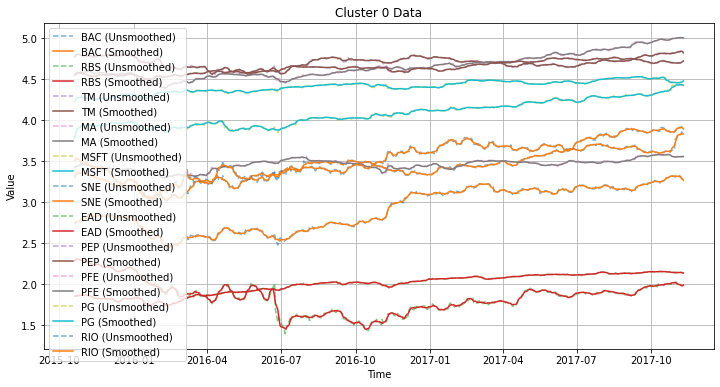
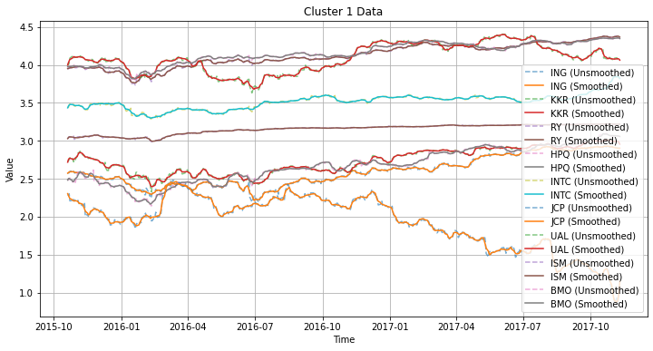
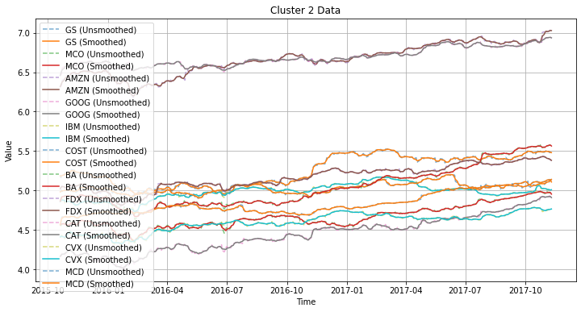
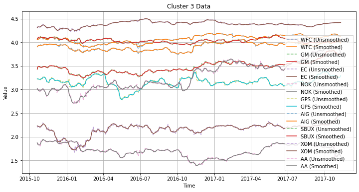
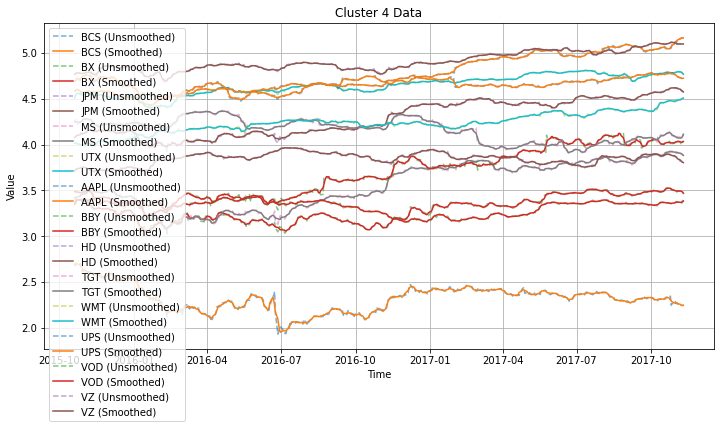
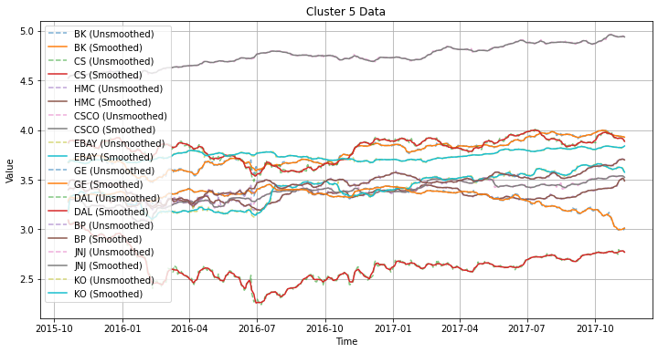
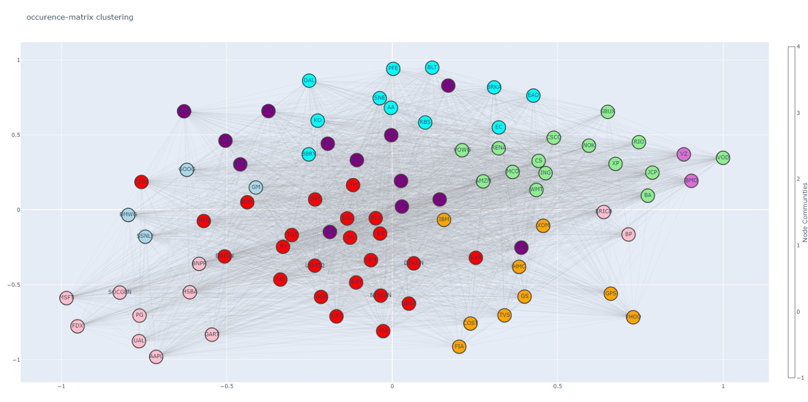

---

# **Updates Since Last Week**

### Done Last Week

- Adding some metrics for the number of clusters
- Adding code for co-occurrence network of graph
- Adjusting graph visualizations

### Next Week Plans

- Start working on the Kalmann approach to exploit the graph structure
- try DDTW by considering time intervals relevant to a news article
---

# **Enhancing Equity Predictions Using Informational Signals**

<br>
<br>

#### **Group Members:** Bella Macaluso - Elizabeth Yang - Sourav Vemulapalli - Aditiya Palliyil - Joseph Jabbour
#### **Githup repo:** https://github.com/bour278/info-signal-analysis
---

# **Table of Contents**

<br>
<br>

**1- General Overview**
**2- Data Sources**
**3- Methodology**
**4- Limitations**

---

# **General Overview**

- 🎯 **Target**: Enhance equity predictions using informational signals
  
- 🛠️ **Methods/Tools**: - Derivative Dynamic Time Warping (DDTW) - Louvain/Leiden Community Clustering - Kalman Filtering - Markov Random Fields
---

# **General Overview**



---

# **Data Sources**

- **Kaggle:** [Daily OHLC data for US-based equities](https://www.kaggle.com/datasets/paultimothymooney/stock-market-data)


| Date | Open | High | Low | Close | Volume | OpenInt |
| --- | --- | --- | --- | --- | --- | --- |
| 1984-09-07 | 0.42388 | 0.42902 | 0.41874 | 0.42388 | 23220030 | 0 |
| 1984-09-10 | 0.42388 | 0.42516 | 0.41366 | 0.42134 | 18022532 | 0 |

---

# **Data Sources**

- **Github:** [Reuters Financial Dataset](https://github.com/Danbo3004/financial-news-dataset)


```
-- Samsung aims to double its smartphone sales in Africa in 2014
-- 
-- Wed Nov 13, 2013 2:29am EST
-- http://www.reuters.com/article/2013/11/13/us-africa-samsung-idUSBRE9AC08620131113

 

 CAPE TOWN  (Reuters) - Samsung Electronics expects to supply half of the smartphones sold in Africa
 this year and aims to double these sales on the continent in 2014, an executive said. 
 ```

---

# **Data Sources**

- **Scraping:** [New York Times News Archive](https://github.com/Danbo3004/financial-news-dataset)


```
Chadwick Boseman Played Black Icons, Found Fame With ‘Black Panther’
11:20 PM ET
--------------------------------------------------------------------------------
Japan
Abe Will Resign as Japan’s Prime Minister, Citing His Health
10:17 PM ET
--------------------------------------------------------------------------------
Politics
Thousands March on National Mall, Continuing Racial-Justice Push
10:11 PM ET
--------------------------------------------------------------------------------
 ```

---

# **Background information - DDTW**

```
Input: Two time series S and T
Output: Distance between S and T

1. Compute the first derivative of S and T
2. Initialize the matrix D with zeros
3. For i = 1 to length(S)
4.     For j = 1 to length(T)
5.         Compute the distance between the i-th element of S and the j-th element of T
6.         If i > 1 and j > 1
7.             D[i,j] = distance + min(D[i-1,j], D[i,j-1], D[i-1,j-1])
8.         Else
9.             D[i,j] = distance
10. Return D[length(S), length(T)]
```
---

# **Background information - DDTW**

<style>
img[alt~="center"] {
  display: block;
  margin: 0 auto;
}
</style>


---

# **Methodology - Pre-Processing**

- **Savitzky-Golay Filtering:** removing noise from historical time series data using polynomial interpolation at a fixed-length window
<style>
img[alt~="center"] {
  display: block;
  margin: 0 auto;
}
</style>



---

# **Methodology - DDTW Clustering**

- **DDTW:** algorithm finding shortest path distance between 2 time series using dynamic programming approach
- **Graph Representation** Adjacency matrix is built from pairwise DDTW distances between each pair of equities

---

# **Methodology - DDTW Metrics**

- **k-means optimal number of clusters:** For this case, we used the _silhouette score method_ to computer the optimal number _k_ of clusters. The best _k_ was achieved at _k=2_.
- **inter-variance of numner of the graph** Metric to determine how efficient the clustering method computed by $\frac{\sum_{i}^{K}n_{i}||c_{i}-\bar{x}||^{2}}{K}$ where $c_{i}$ represent the centroid of the $i^{th}$ cluster and $\bar{x}$ is the global mean of the graph.


---

# **Methodology - News Co-occurrence**

- **News co-occurence matrix:** Matrix $A$ where $A_{i,j}$ corresponds to the number of news articles where stock $i$ appeared with stock $j$.
- **Louvain Clustering** Community detection algorithm that helps retrieve clusters in a graph and does not require setting the optimal number of clusters before running the algorithm.
---

# **Results - Log Close Graph Cluster**

<style>
img[alt~="center"] {
  display: block;
  margin: 0 auto;
}
</style>


[rendered HTML for the graph](https://jsfiddle.net/9pwnjrtL/)

---

# **Results - Log Close Graph Cluster**

<style>
img[alt~="center"] {
  display: block;
  margin: 0 auto;
}
</style>


[rendered HTML for the graph](https://jsfiddle.net/9pwnjrtL/)

---

# **Results - Time Series Cluster 0**

<style>
img[alt~="center"] {
  display: block;
  margin: 0 auto;
}
</style>



---
# **Results - Time Series Cluster 1**

<style>
img[alt~="center"] {
  display: block;
  margin: 0 auto;
}
</style>



---
# **Results - Time Series Cluster 2**

<style>
img[alt~="center"] {
  display: block;
  margin: 0 auto;
}
</style>



---
# **Results - Time Series Cluster 3**

<style>
img[alt~="center"] {
  display: block;
  margin: 0 auto;
}
</style>



---
# **Results - Time Series Cluster 4**

<style>
img[alt~="center"] {
  display: block;
  margin: 0 auto;
}
</style>



---
# **Results - Time Series Cluster 5**

<style>
img[alt~="center"] {
  display: block;
  margin: 0 auto;
}
</style>



---
# **Results - Co-occurrence Network**

<style>
img[alt~="center"] {
  display: block;
  margin: 0 auto;
}
</style>


[rendered HTML for the graph](https://jsfiddle.net/28pqtdaj/)

---

# **Limitations (More to be found ⏳)**

- Limited tick data
- Computationally expensive to build graphs for long-time series